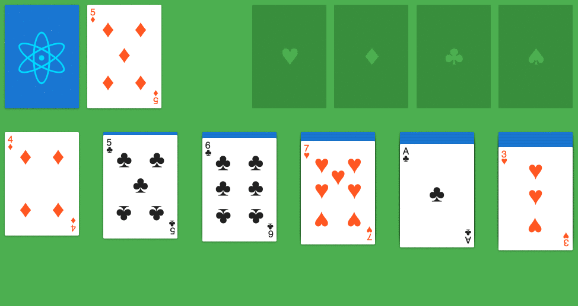

# react-solitaire

[](https://travis-ci.org/gcedo/react-solitaire)
[](https://david-dm.org/gcedo/react-solitaire.svg)

React implementation of the famous solitaire card game



React-solitaire features a suite of technologies for frontend development that I do deeply cherish:

- ui ➜ [react](https://facebook.github.io/react/)
- application architecture ➜ [redux](http://redux.js.org/)
- drag & drop ➜ [react-dnd](http://gaearon.github.io/react-dnd/)
- immutable data ➜ [immutable](https://facebook.github.io/immutable-js/)
- transpiling ➜ [babel](https://babeljs.io/)
- bundling ➜ [webpack](https://webpack.github.io/)
- testing ➜ [mocha](https://mochajs.org/)

Take a look at the [demo](http://gcedo.github.io/react-solitaire/dist/index.html).

## Quick Start
```
$ npm install
$ npm start
$ open http://localhost:3000
```
